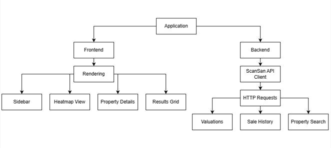

# UK Property Search & Analysis Platform

A Streamlit-based application for searching UK properties and analysing their sustainability and price trends using the Scansan API.

## 📋 Project Overview

This hackathon project provides an interactive interface to search properties across the UK, view detailed information including sustainability scores, price history forecasts, and market comparisons.

**Live Demo:** Run `streamlit run app.py` to start the application.

---

## 🏗️ Architecture & Decomposition

### System Components



### External Integrations

- **Scansan API** - Third-party property data and valuations service
- **Streamlit** - Web UI framework
- **Plotly** - Interactive charting library

### Data Flow

```
User Input (Search)
    ↓
app.py (validate & route)
    ↓
main.py (process search)
    ↓
scansan_client.py (fetch data)
    ↓
Scansan API (external)
    ↓
Parse Results → Mock Fallback (if needed)
    ↓
Display (Grid View or Details View)
```

---

## 📁 File Structure

| File | Purpose |
|------|---------|
| `app.py` | Main Streamlit interface & view orchestration |
| `main.py` | Core search logic, sorting, validation, mock data |
| `scansan_client.py` | API client for Scansan service |
| `config.py` | Central configuration (API keys, URLs, areas) |
| `household_integration.py` | Wrapper for household_info_page integration |
| `household_info_page.py` | Visualisation components (charts, gauges) |
| `model.py` | ML model placeholder (incomplete) |
| `validate_uk_areas.py` | Utility to validate UK areas against API |
| `UKAreas.py` | Legacy areas file (deprecated, use config.py) |

---

## 🚀 Setup & Run

### Prerequisites
- Python 3.10+
- pip package manager

### Installation

**Windows (PowerShell):**
```powershell
py -m venv .venv
.\.venv\Scripts\Activate.ps1
py -m pip install --upgrade pip
py -m pip install -r requirements.txt
py -m streamlit run app.py
```

**macOS/Linux (bash/zsh):**
```bash
python3 -m venv .venv
source .venv/bin/activate
python3 -m pip install --upgrade pip
python3 -m pip install -r requirements.txt
python3 -m streamlit run app.py
```

The app will open at `http://localhost:8501`

---

## 🔧 Usage

1. **Search for Properties:**
   - Select a UK area from the dropdown
   - Enter a search query or use postcode + street search
   - Click "Search"

2. **View Results:**
   - Properties displayed in 3-column grid
   - Sort by price (current/future), or default order
   - Click "View Details" on any property

3. **Property Details:**
   - Current, last sold, and predicted future prices
   - Sustainability score with gauge visualisation
   - Price history and forecast trends
   - Save to favorites (placeholder)

---

## 🧪 Utilities

### Validate UK Areas
Test all areas in config.py against the Scansan API:
```bash
python validate_uk_areas.py
```
Outputs: `validation_results.json` with valid/invalid/error categorisation.

---

## 📊 Key Features (Current)

- ✅ Multi-area property search
- ✅ Advanced search (postcode district + street)
- ✅ Sort by price
- ✅ Property cards with current/future pricing
- ✅ Detailed property view
- ✅ Sustainability score visualisation
- ✅ Mock data fallback for API failures

## 🔮 Planned Features

- 🔄 ML price prediction model
- 🗺️ Heatmap visualisation
- ❤️ Favorites/watchlist
- 📊 Market comparison analytics
- 🔔 Price alert notifications

---

## 📝 Notes

- This repository is **private** until the hackathon is over
- API credentials stored in `config.py` (keep secure)
- 170 validated UK areas in dropdown (filtered via `validate_uk_areas.py`)
- Mock database fallback available for development/testing

---

## 👥 Team & Roles

| Role | Responsible | Key Areas |
|------|-------------|-----------|
| **Frontend Developer** | James & Nirmal | Streamlit UI, user interactions, visualisation components |
| **Backend Developer** | William | API integration, business logic, data processing, config management |
| **ML/Data Engineer** | Ed | Price prediction model, sustainability scoring, data analysis |

---

## 👥 Team

UCL ML Hackathon 2026
